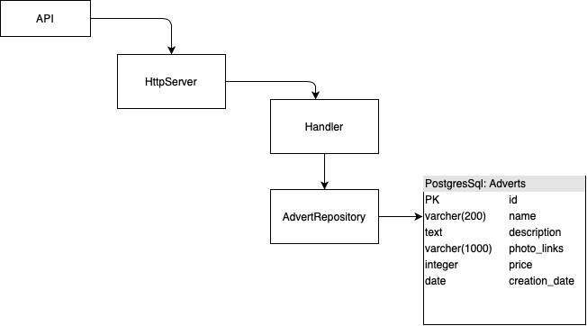

# Описание проекта

HTTP JSON API сервис для хранения и подачи объявлений

# Требования

- Язык программирования Go/PHP;
- Финальную версию нужно выложить на github.com;
- Простая инструкция для запуска;
- 3 метода: получение списка объявлений, получение одного объявления, создание объявления;
- Валидация полей: не больше 3 ссылок на фото, описание не больше 1000 символов, название не больше 200 символов;

# Запуск

```
docker-compose up
```

# API

## Работа с объявлениями:

### Метод создания объявления

- Параметры запроса:
    - name - название
    - description - текстовое описание
    - links - ссылки на фотографии через пробел
    - price - цена

- Параметры ответа:
    - id - id созданного объявления
    - result - код результата, в случае успеха: "success", при неудаче: "failed"

Запрос:

```
curl -X POST -d "name=some name" -d "description=some description" \
-d "links=link1 link2 link3" -d "price=1000" "http://localhost:8080/advert/create"
```

Ответ:
```
{"result":"success","id":6}
```

### Метод получения конкретного объявления

- Параметры запроса:
    - id - Принимает на вход ID объявления.
    - fields - В данном параметра передаются опциональные поля(описание, ссылки),
    которые можно получить дополнительно 

- Параметры ответа:
    - name - Название объявления
    - description - ОПЦИОНАЛЬНОЕ ПОЛЕ описание объявления
    - photo_links - ОПЦИОНАЛЬНОЕ ПОЛЕ ссылки на фотографии
    - price - цена

Запрос:

```
curl "http://localhost:8080/advert/get/7?fields=links" 
```

Ответ:
```
{"advert_id":7,"name":"some name","photo_links":"link1 link2 link3","price":1000}
```

### Метод получения списка объявлений

- Параметры запроса:
    - page - Номер страницы
    - sort - Принимает на вход параметр, ко которому должна производится сортировка:
      price - для сортировки по цене, date для сортировки по дате создания.
 Для сортировки в обратном порядке нужно добавить "-" перед параметром price/date

- Параметры ответа:
    - name - Название объявления
    - description - описание объявления
    - photo_links - ссылки на фотографии
    - price - цена
    
- С помощью пагинацию отдается по 10 объявлений на одной странице

Запрос:

```
curl -X GET "http://localhost:8080/advert/list/0?sort=-price"
```

Ответ:
```
[{"advert_id":5,"name":"Andrew","description":"very nice very nice","photo_links":"first_link 1 2","price":10000},
{"advert_id":11,"name":"name2","description":"description2","photo_links":"link2","price":1000},
{"advert_id":6,"name":"some name","description":"some description","photo_links":"link1 link2 link3","price":1000},
{"advert_id":7,"name":"some name","description":"some description","photo_links":"link1 link2 link3","price":1000},
{"advert_id":8,"name":"newadv","description":"descr","photo_links":"http","price":500},
{"advert_id":10,"name":"name1","description":"description1","photo_links":"link1","price":500},
{"advert_id":4,"name":"newadv","description":"descr","photo_links":"http","price":500},
{"advert_id":2,"name":"newadv","description":"descr","photo_links":"http","price":500},
{"advert_id":9,"name":"name1","description":"description1","photo_links":"link1","price":500},
{"advert_id":3,"name":"newadv","description":"descr","photo_links":"http","price":500}]
```

# Архитектура

